LFG2
====

A shared voxel world that runs in the browser. The base game covers Minecraft's
core survival and creative play, and it is built the way
[docs/ARCHITECTURE.md](docs/ARCHITECTURE.md) describes: a small trusted
**kernel** that hosts **modules**, so player-directed AI agents can later add,
change or replace any part of the game while everyone keeps playing.

| | |
|---|---|
| 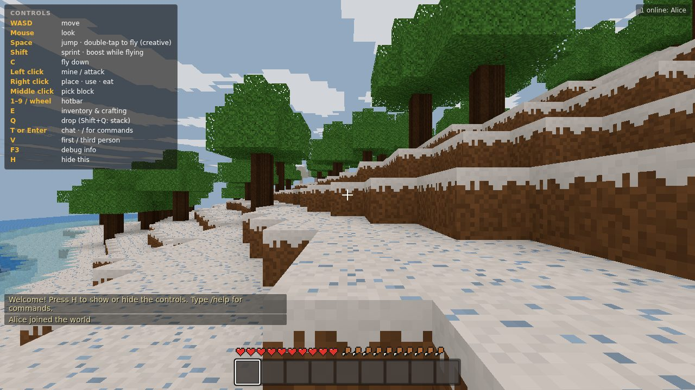 | 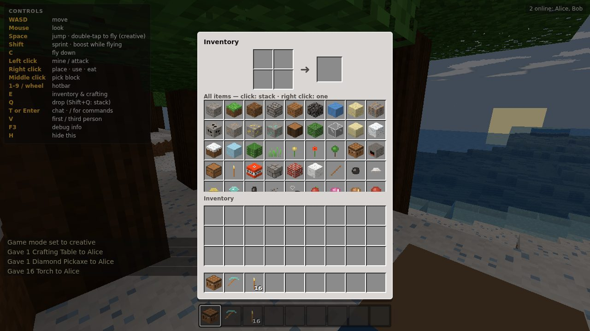 |

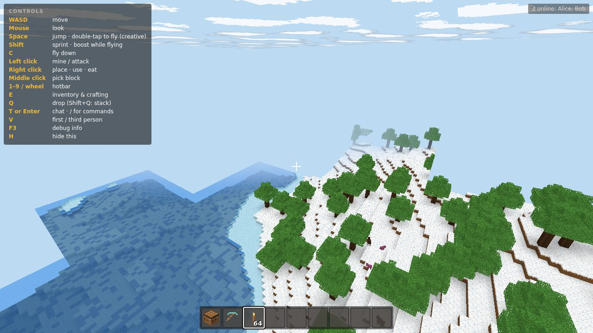

- [docs/ARCHITECTURE.md](docs/ARCHITECTURE.md): the overall design (kernel, modules, sandboxing, world events, crash prevention)
- [docs/standards/](docs/standards/README.md): the shared "world bible" (art style, audio, balance, fun, comfort) that the code reads its numbers from

## Run it

Needs Node 22+.

```sh
npm install
npm run build   # build the browser client
npm start       # game server + client on http://localhost:8080
```

Open http://localhost:8080 in two browser windows to play together. Anyone on
your network can join at `http://<your-ip>:8080`.

For development with hot reload:

```sh
npm run dev     # server on :8080 (restarts on change) + Vite on http://localhost:5173
```

Server settings (environment variables):

| Variable | Default | Meaning |
|---|---|---|
| `PORT` | 8080 | HTTP + WebSocket port |
| `WORLD` | `world` | World name (saved in `data/<WORLD>/`) |
| `SEED` | random | World seed (only used when creating a world) |
| `VIEW_DISTANCE` | 4 | Chunk radius streamed to each player (32 blocks per chunk) |
| `ADMINS` | *(everyone)* | Comma-separated names allowed to use admin commands. Empty = everyone is admin (fine for local play, not for a public server) |
| `DATA_DIR` | `./data` | Where worlds are saved |
| `TRANSCRIBE_URL`, `TRANSCRIBE_API_KEY`, `TRANSCRIBE_MODEL` | *(off)* | Speech-to-text for voice commands (see "Voice commands") |
| `PUBLIC_URL` | `http://localhost:<PORT>` | The address players reach the server at (used in /link instructions and world links) |
| `MAX_WORLDS` | 10 | How many worlds the server holds |

Type commands into the server console too (e.g. `time set night`, `modules`).

## Checks

```sh
npm run typecheck   # TypeScript, all packages
npm test            # unit + server integration + gameplay tests (vitest)
npm run build && npm run e2e   # two players in headless Chromium, saves screenshots to test-results/
npm run e2e:rules              # two players; one changes rules and adds code, the other sees it live
npm run e2e:summons            # summon clouds and a flying shark in the browser; checks it hunts by the rules
npm run e2e:scenario           # a pirate raid in the browser: ships sail in, waves, a boss, a reward
npm run e2e:voice              # voice summons with a fake microphone, levels, a ritual joined with J
npm run e2e:builds             # a village, a mountain city and the power of a wizard in the browser
npm run e2e:mcp                # a chat (MCP client) links, inscribes scrolls, casts, creates and opens a world
npm run e2e:theme              # a "cyberpunk sci-fi samurai" world from words and a reference image, next to the base world
npm run e2e:designs            # a chat designs creatures (brief, check, critique, render, save); summoned, restyled smooth, then sculpted by a player's setting
PORT=8080 BOTS=30 node scripts/loadtest.mjs   # bot players against a running server
```

With 30 bot players walking around, the server ticks in about 8 ms (11 ms at peak while terrain
is being generated), well inside the 50 ms tick budget.

## What the base game covers

**World**
- Infinite horizontal world, 128 blocks tall, in 32×32×32 chunks, streamed around each player
- Deterministic terrain from the seed: oceans, beaches, plains, forests, deserts, snowy plains, mountains
- Caves (tunnels and large caverns), ores by depth (coal, iron, gold, diamond), gravel pockets, bedrock floor
- Trees, tall grass, flowers, cactus, ice on snowy water
- Day/night cycle (20 minutes), sun, moon, stars, clouds; smooth lighting from the sky and from torches
- World saves to disk every 30 s and on shutdown; players' inventories and positions are saved

**Playing**
- Walk, sprint, jump, swim; creative flight (double-tap Space)
- Mining with Minecraft's dig-time rules: hardness, the right tool, tool tiers (wood → stone → iron → diamond), tool wear
- Placing blocks; sand and gravel fall; plants and torches need support; saplings grow into trees; grass spreads
- 33 blocks and 34 other items (67 in total), including wood, stone, iron and diamond tools and swords; 28 crafting recipes and 9 smelting recipes
- Crafting in a 2×2 grid (inventory) or 3×3 (crafting table), shaped and shapeless recipes, shift-click crafting
- Furnaces (fuel, smelting ores, cooking food, glass, stone, bricks) and chests (shared between players)
- Survival: health, hunger, regeneration, fall damage, drowning, cactus damage, eating, death drops and respawn
- Mobs: pigs, cows and chickens (wander, flee, drop food); zombies (chase at night and in caves, burn in daylight); creepers (hiss, then explode)
- Melee combat with knockback and jump-crits; PvP is off unless an admin turns it on (`/pvp on`)
- TNT lit with flint and steel, chain reactions, craters
- Survival and creative modes; creative inventory with every item
- Multiplayer: see other players with name tags, chat, shared world changes in real time

**Commands**: `/help`, `/gamemode`, `/give`, `/tp`, `/time set`, `/spawn`, `/setspawn`, `/kill`, `/seed`,
`/list`, `/summon`, `/unsummon`, `/event`, `/ritual`, `/join`, `/progress`, `/cost`, `/build`, `/keep`, `/powers`, `/link`, `/unlink`, `/inscribe`, `/cast`, `/scrolls`, `/worlds`, `/world`, `/xp`, `/aether`, `/pvp`, `/rule`, `/events`, `/modules`, `/module`, `/stats`

## Changing the world while people play

Rules and code change live, for everyone at once, as **world events**: no restart, nobody
disconnected. Each change gathers (announced with a countdown), arrives for the server and every
client in the same tick, and is then watched for 30 seconds. If it breaks something (a module
starts failing, the server slows down, lots of players die), it is undone automatically.

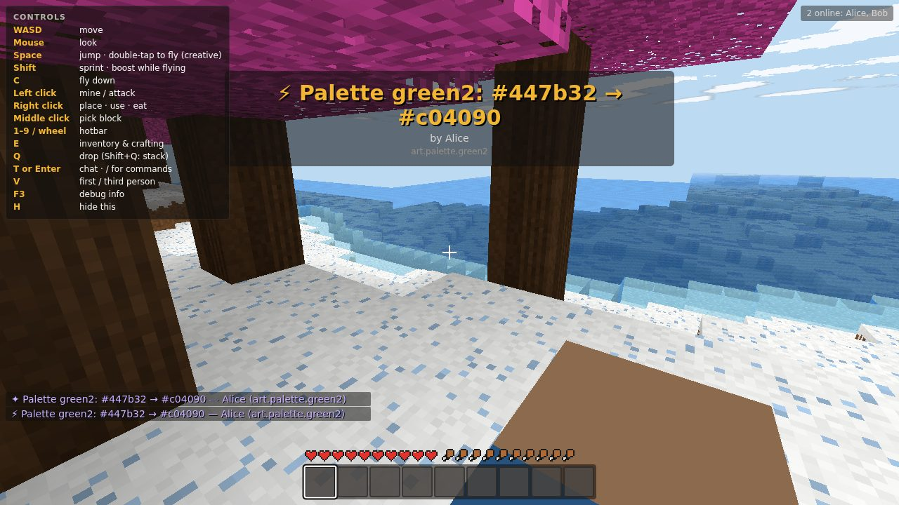

**Rules** are the values in [docs/standards/defaults.json](docs/standards/defaults.json): gravity,
speeds, damage, the colour palette and more.

```
/rule list balance.player          see the current values
/rule set balance.player.jumpBlocks 4
/rule set art.palette.green2 #c04090    (leaves turn pink: textures repaint live)
/rule undo                          roll back the latest rule change
/events                             what's happening and what changed recently
```

Locked values (health, safety and performance limits) can't change; a value must keep its type
and can change by at most 10× at once. Changes are saved with the world.

**Code**: drop a module file into `data/<world>/modules/` (this is what an agent will do) and it
arrives the same way. While gathering it is compiled, imported fresh, and **shadow-run** for 2 s
of game time against the real world with all its writes thrown away; files that don't load, throw,
try to import other code, or take more than 5 ms per tick fizzle and never reach the world.

```
/module examples                    chicken-rain, feather-fall, broken-on-purpose, typo
/module install chicken-rain        chickens fall from the sky every 20 s
/module install broken-on-purpose   arrives, starts failing, gets undone automatically
/module remove example:chicken-rain
/module off vanilla:mobs            vanilla modules can be switched off and on too
```

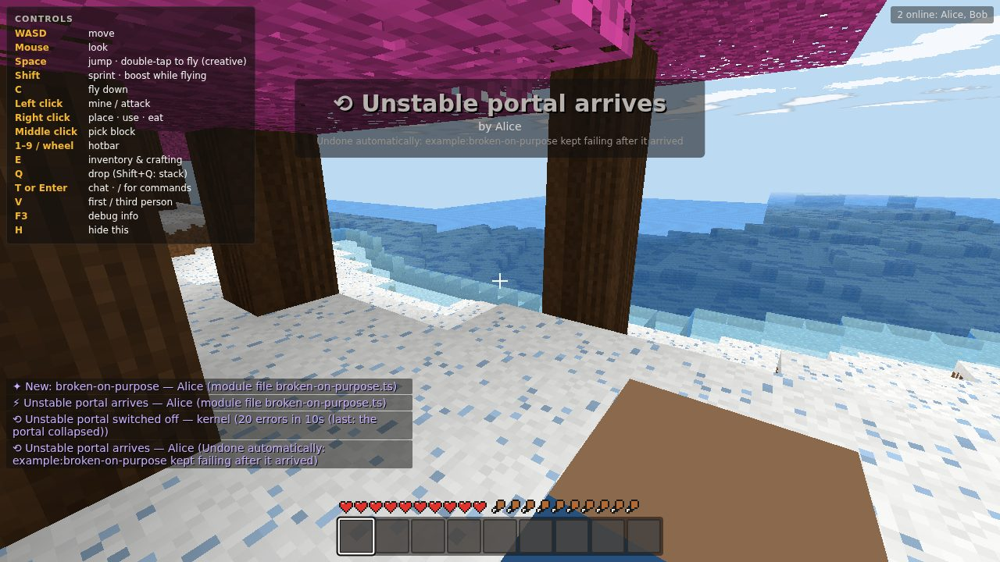

Normally changes are spaced out (one at a time, 20–60 s apart, palette/art changes 10 minutes
apart, per the pacing standards). Start the server with `EVENT_PACING=fast` to try things quickly.

A module is a file that `export default`s `{ id, name, version, author, description, setup(api) }`;
see [examples/modules/](examples/modules/) and the `ModuleApi` in
[packages/server/src/api.ts](packages/server/src/api.ts).

## Summoning things

`/summon <anything>`: `/summon a big cloud`, `/summon a flying shark`, `/summon a storm cloud`,
`/summon three angry wolves`, `/summon a cute pink dragon`, `/summon a pirate ship`, `/summon a viking`… Each summon is a
world event:

1. **Plan**: the request becomes a *summon spec*: body plan (cloud, fish, bird, quadruped, blob, biped, ship),
   size, colours from the world palette, features (teeth, fins, wings, horns…), how it moves
   (drift, fly, swim, walk, hover), temperament and abilities (bite, rain). Today a simple
   keyword planner does this; a player's agent will write specs directly.
2. **Fit to the rules**: too big, too many, or a hostile thing that's too large gets scaled back,
   with a note saying so.
3. **Generate the 3D model** in code (`packages/shared/src/summons/generate.ts`): voxel parts
   (body, tail, fins, wings, legs) that animate, greedy-meshed. Server and every client build the
   same model from the spec.
4. **Check the model** against the art standards: size category and triangle budget, palette and
   reserved colours, back/belly contrast, and a silhouette test for clouds.
5. **Shadow playtest** the behaviour on the real terrain with three virtual players (one stands
   still, one sidesteps when warned, one runs). It fails if a bite comes without enough warning,
   hits harder than the cap, comes before the cooldown, or can't be dodged.
6. **Arrive** where it suits: clouds high above the ground, flyers a few blocks up, swimmers in
   nearby water (or it explains it needs water).

| Model review (viewer) | In the world |
|---|---|
| 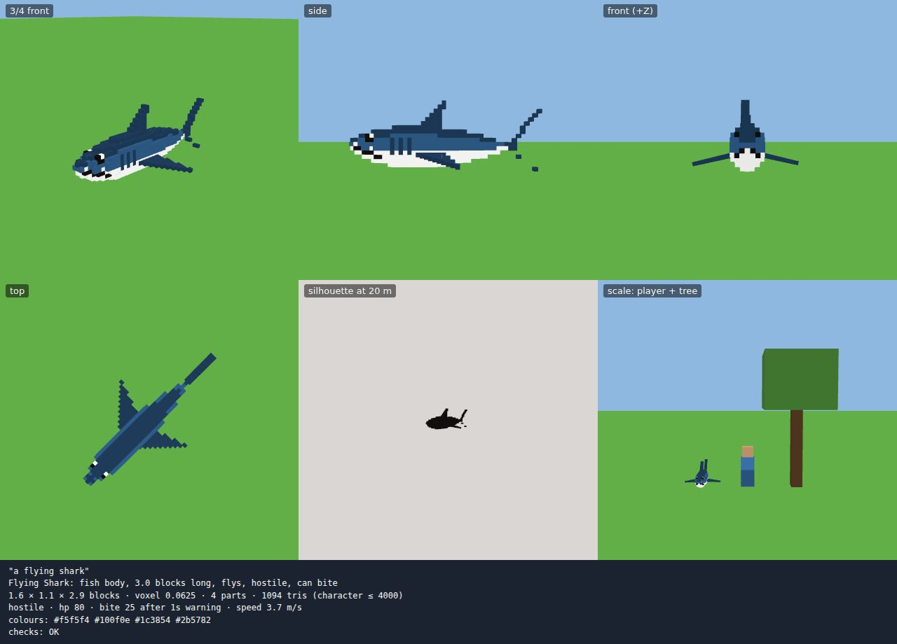 | 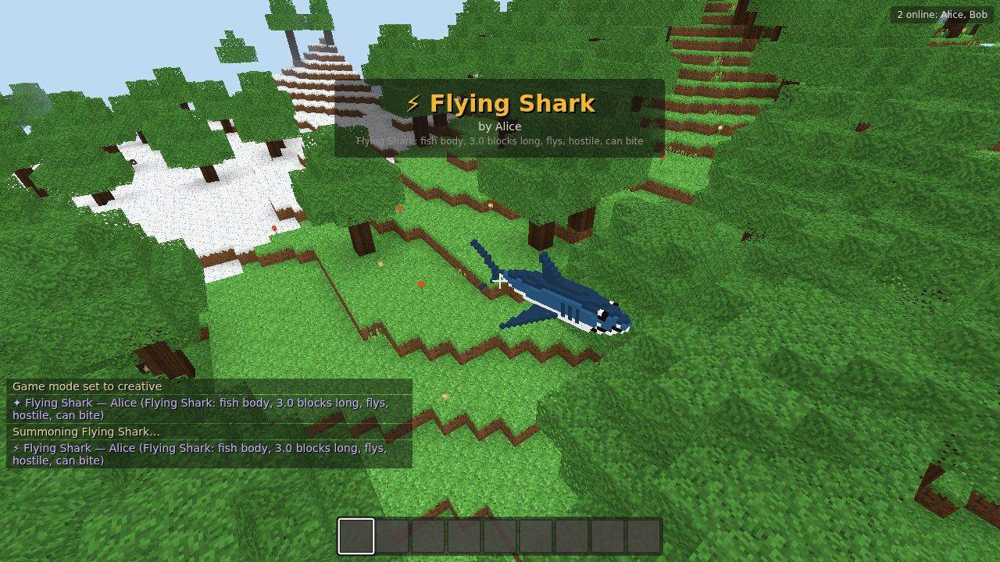 |
| 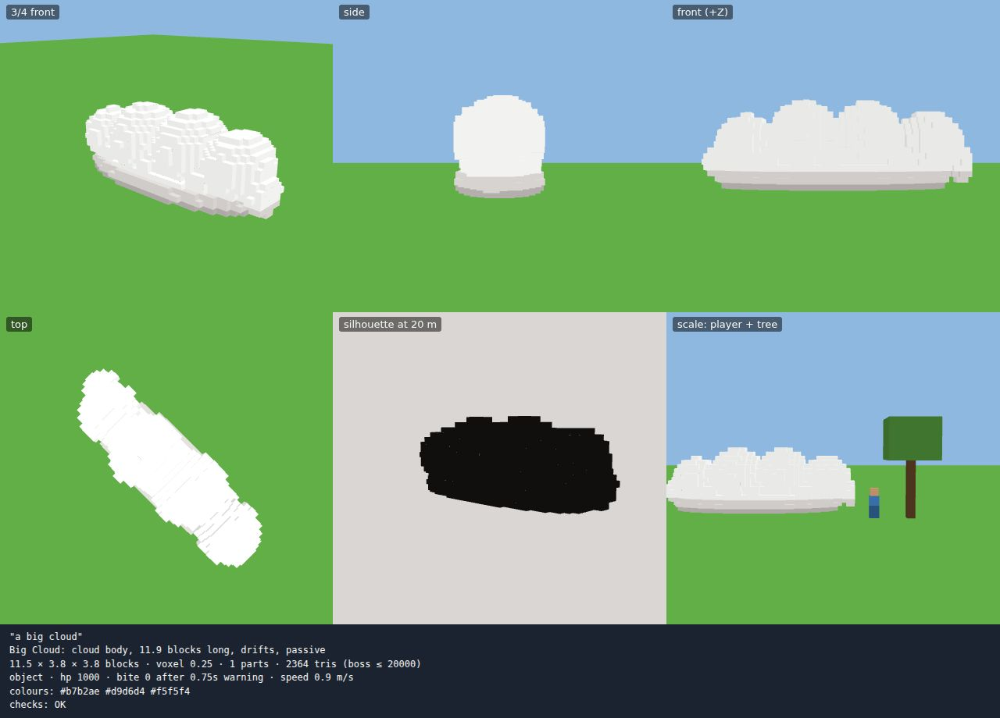 | 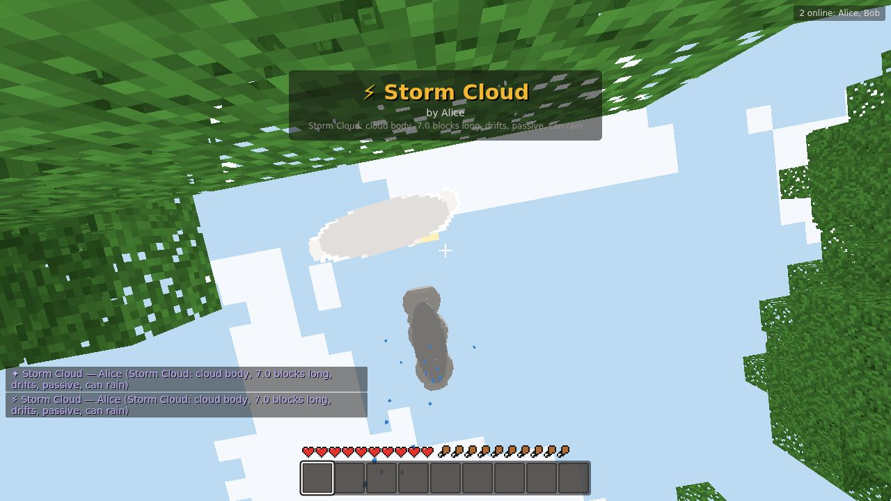 |

**Default behaviours** come from the fun and balance standards:
- **Clouds** drift slowly about 22 blocks above the terrain and stay near where they were made;
  storm clouds rain. They're scenery: they can't be attacked and don't hurt anyone.
- **Hunters** (a flying shark, a red dragon, angry wolves) circle visibly first. Then, only with a
  clear line to you and within reach, they hover, **pulse in the danger colour and hiss** for at
  least the warning time (1 s for heavy bites), and lunge in a straight line you can sidestep.
  After a bite they retreat and wait a cooldown.
  - They're slower than a walking player, so running works, and they give up after 32 blocks.
  - Trees and caves shelter you.
  - They never hunt within 24 blocks of spawn or anyone in creative.
  - Bites are capped at 40% of health.
- **Neutral** creatures fight back when hit; **passive** ones flee.
- **Limits**: 6 summons per player, 40 per world, 3 hostile ones at a time (the hazard limit).
  `/unsummon` removes yours.

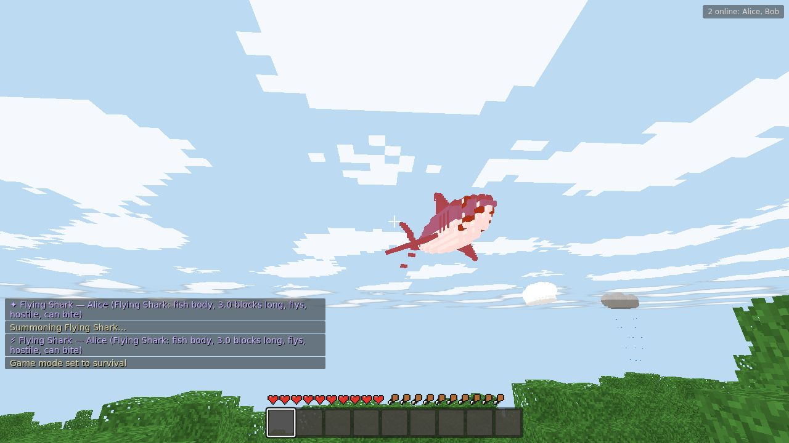

Review generated models without starting the game:
`npm run build && npm run view:summons "a flying shark" "a big cloud"` renders each prompt from
several angles, as a silhouette at 20 m, and next to a player and a tree for scale, with the
checks report (images in `test-results/summons/`, or open `/viewer.html?prompt=…` in the browser).

## Scenarios: invasions in waves

`/event a swarm of ships arrive at the nearest coast and enemies come out in waves, with increasing
difficulty and some bosses` (or `/event vikings raid the coast in 3 waves`, `/event a ghost fleet
attacks with a boss`; `/summon` passes these on too). A scenario is a world event with a story arc:

1. **Plan** a *scenario spec*: a theme (pirates, vikings, skeletons), how many ships, the waves
   (more enemies each wave, brutes from wave 3), a final boss (and one mid-way) when you ask
   for bosses, a final boss in raids of 4+ waves anyway, breaks, a reward. Sizes scale with the number of players nearby (by √players).
2. **Find the nearest coast** with open sea in front of it, outside the spawn safe zone: a low
   beach, water deep enough for a keel to anchor in, and a clear lane out to sea for each ship.
3. **Check** every model (ship, raiders, brutes, bosses) against the art standards.
4. **Shadow playtest every wave** on the real terrain against virtual defenders who fight back and
   (sometimes) dodge, with the same enemy brains the server runs. It fizzles if a hit is over the
   cap, a boss slam hits someone who was already stepping out, or a wave can't be finished, and
   reports too many deaths or difficulty that doesn't build up.
5. **Run it live**: the ships appear out at sea and sail in, dropping anchor in the shallows.
   Raiders jump off a few at a time (at most 8 on the field), wade ashore and go for the nearest
   defenders. Bosses get a health bar and a ground slam with a ring you step out of. Between waves
   there's a 15 s breather. Win and a reward chest appears on the beach; if everyone leaves (or
   time runs out) the raiders give up. Either way the ships sail away and everything is cleaned up.

| Ships sail in | Wave 1 comes ashore |
|---|---|
| 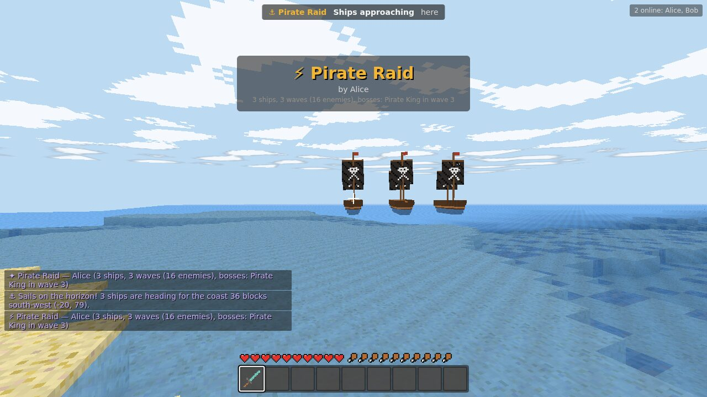 | 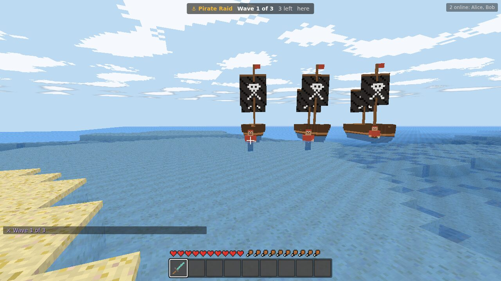 |
| **The final boss, with its health bar** | **Victory: the ships leave** |
| 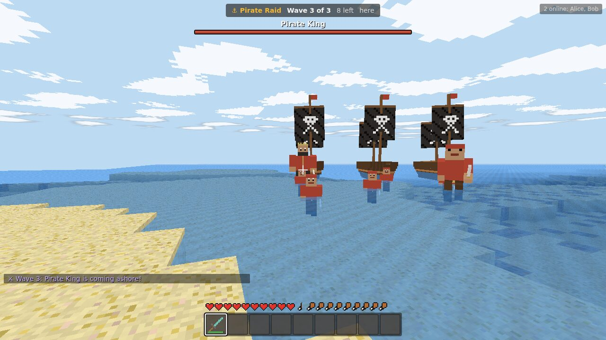 | 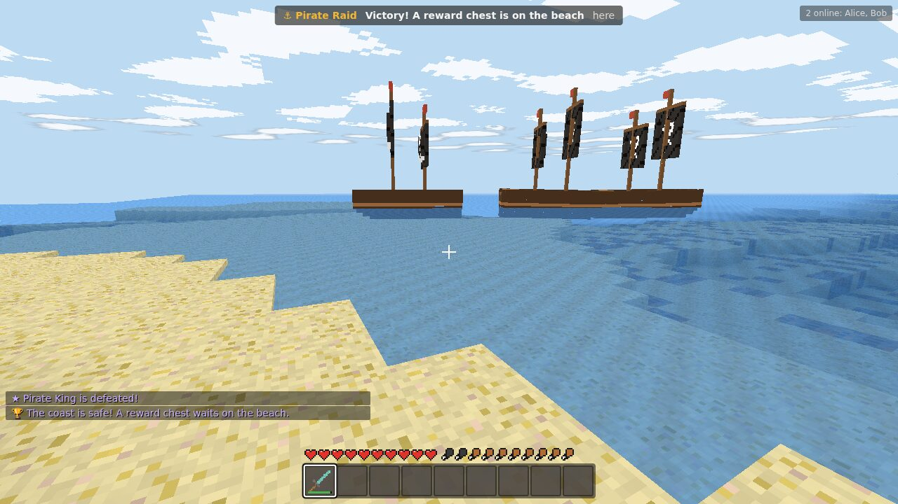 |

Review the cast without playing: `npm run view:summons "pirates raid in 5 waves with bosses :: final"`
(or `:: ship`, `:: grunt`, `:: brute`, `:: boss`).

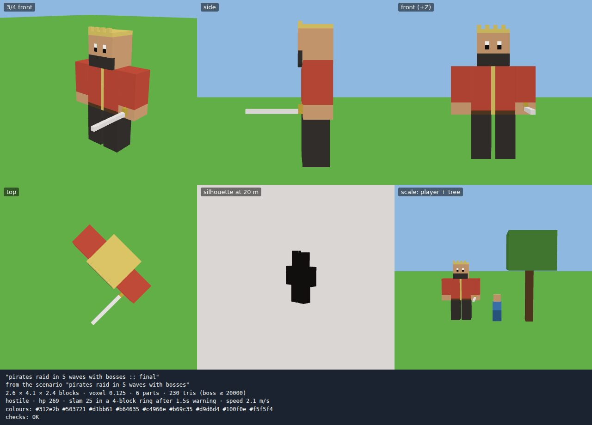

The HUD shows the wave, how many are left, and an arrow with the distance to the beach, for
everyone in the world. `/event stop` calls it off (whoever started it, or an admin). One scenario
runs at a time, and it counts as one hazard against the hazard limit.

## Levels and summoning power

What you can summon grows with your level (the full design is in
[docs/standards/progression-and-power.md](docs/standards/progression-and-power.md)):

- **Tiers.** Every summon or scenario is rated by what it would actually be (size, numbers,
  danger, bosses, weather), from tier 1 (a pig, a cloud) to tier 5. Levels 1, 4, 8, 12 and 17
  unlock tiers 1–5. Ask above your tier and you get the biggest version you can cast, with a note:
  *"Red Dragon is tier 3 (5 blocks long, hostile, heavy hits): it needs level 8, or a ritual"*.
- **Rituals.** `/ritual a red dragon` opens a circle; others stand in it and press **J** (or
  `/join`). Each helper adds 2 levels, up to one tier above the leader; the cost is shared and
  helpers get XP.
- **Aether and shards.** Casting costs aether (a bar of 100 that refills 1 a minute, slower
  offline): 5, 15, 35, 60 or 100 by tier. Tiers 3+ also cost aether shards, from bosses and won
  scenarios. If a summon fizzles you get 75% back.
- **XP.** About 40 hours to level 20, fast at first. A little from normal play (capped per
  minute), most from shared moments: defending raid waves, beating bosses (split by damage),
  winning, joining rituals, and other players spending time with or fighting what you summoned.
- **Tuning.** XP rates, costs and refill speed are world rules (`/rule set progression.…`); the
  level cap, the tiers and the levels that unlock them are locked.
- `/progress` shows yours; admins can use `/xp give|level`, `/aether fill|shards`.

### Epic builds and powers

- **Builds**: `/summon a village`, `/summon a castle`, `/summon a wizard tower`,
  `/summon a city with a whole civilization on the mountainside`. They rise from the land in
  front of you (never over anything players built, or the spawn area), villages and cities with
  villagers. They last 72 hours unless other players adopt them (spend a minute there, or
  `/keep`), then fade back, restoring the land. `/build list | here | expire`.
- **Powers**: `/summon the power of a wizard` (fire bolt R, blink F, frost nova G, night vision;
  10 min), `wings` (flight in survival, 3 min), `swiftness`, `night vision`, `water breathing`,
  and once a day, `become an avatar of the storm`. Everyone sees an aura on a powered player.
- **Costs**: `/cost a huge kraken` says the tier, the level it needs, aether, shards and AI
  budget, what you'd get at your level, and how many ritual helpers it would take.

| A village (tier 4) | Inside a city (tier 5) | The power of a wizard |
|---|---|---|
| 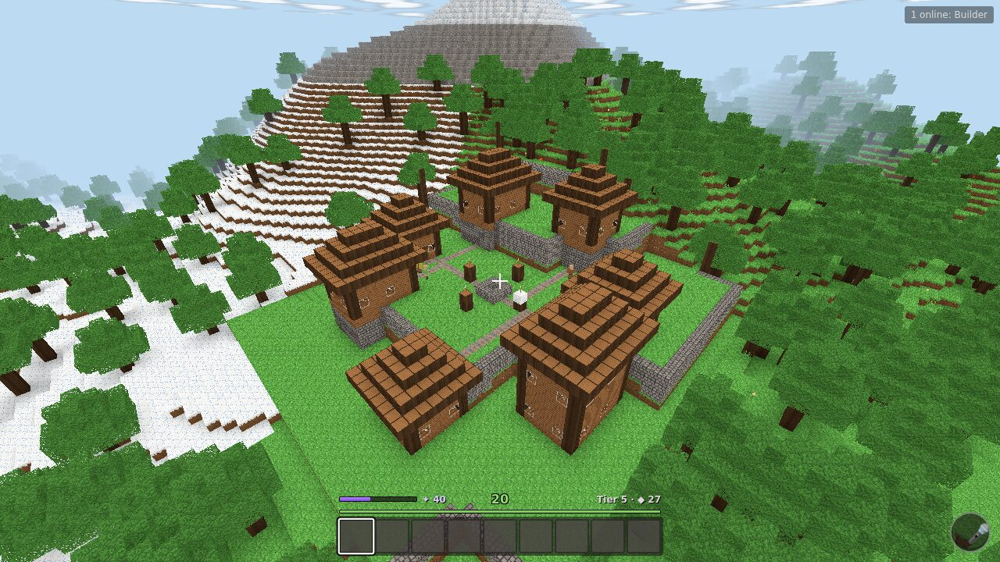 | 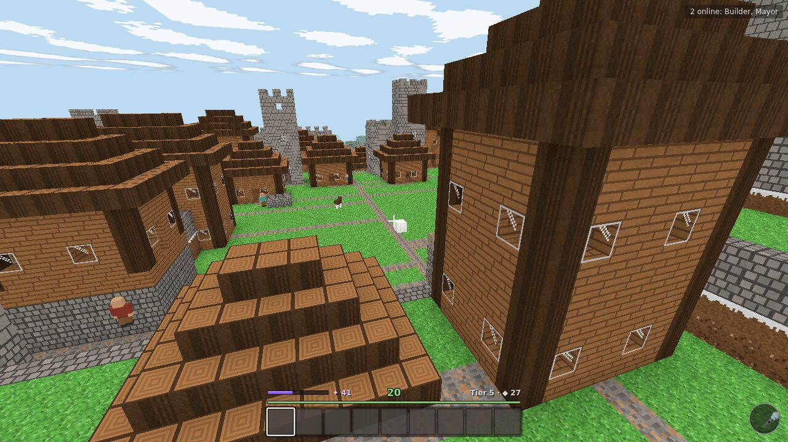 | 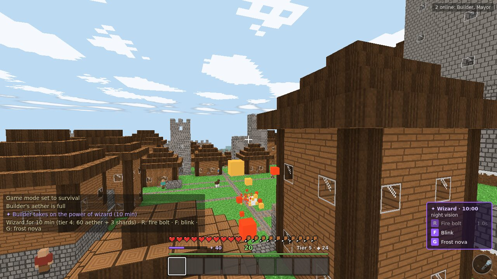 |

## Preparing summons in ChatGPT or Claude (MCP)

The server includes an [MCP](https://modelcontextprotocol.io) server at `/mcp`, so people can
work out what they want to summon in a chat with ChatGPT, Claude or any other MCP client, see
what it would cost, and load it into the game as **scrolls** in their spellbook.

1. In game, type `/link`: you get a one-time code (works once, for 10 minutes).
2. Add the MCP server to your chat app with the URL `https://<your server>/mcp`. In Claude, add it as
   a custom connector. In ChatGPT, add it as a connector (developer mode). In Claude Code, run
   `claude mcp add --transport http lfg2 http://localhost:8080/mcp`. Chat apps that run in the cloud
   need a public HTTPS address, so for a server on your own machine use a tunnel.
3. Ask the chat to "link my player with code K7Q-M3P". It acts for that player in that world
   only. `/unlink` disconnects every linked chat.

What the chat can do:

| Tool | What it does |
|---|---|
| `get_world_guide` | The tier ladder (levels, aether, shards, AI budget), everything the world can make (creatures, raid themes, builds, powers), its look and rules, so prompts fit the world |
| `estimate_cost` | What a prompt makes, its tier and the level it needs, the full cost, what you'd get at your level, ritual helpers needed, and what inscribing it costs. Refining prompts in the chat is free |
| `inscribe_scroll`, `list_scrolls`, `remove_scroll` | Save a prompt as a named scroll. Inscribing checks it the way casting will and costs a fifth of its casting aether; scrolls appear in game at once. Works while you're offline |
| `cast_scroll` | Cast a scroll where you stand (you must be in the world): full price, a normal world event |
| `get_progress` | Level, XP, aether, shards, tier, next unlock |
| `create_world`, `configure_world`, `open_world`, `list_worlds` | Make a world of your own with a look (a theme from words and reference images, or a palette preset), a starting time, day length, PvP and other rules. It stays closed (only you can join) until you open it |
| `preview_theme` | What a theme would do (palette, materials, light, music, build style, raid theme) before creating anything |
| `get_design_guide`, `check_design`, `render_design` | Design something new instead of describing it: the chat writes a model as parts made of primitives, checks it (issues come back with JSON paths and fixes, plus a playtest), and looks at renders in the world's style |
| `interpret_prompt`, `get_design_skill` | The art director: words → a brief (skill, mood, style, what must read) and a starting design from the game's design skills, which are also SKILL.md files a chat can keep |
| `save_design`, `list_designs`, `remove_design` | Save a design to the world: anyone there can `/summon design:<id>`, and a scroll can hold `design:<id>` |

In game, press **K** for the spellbook (cast with a click), type `/cast <name>`, or say
*"cast kraken storm"*. `/inscribe <name> = <prompt>` makes scrolls without a chat, and `/scrolls`
lists them.

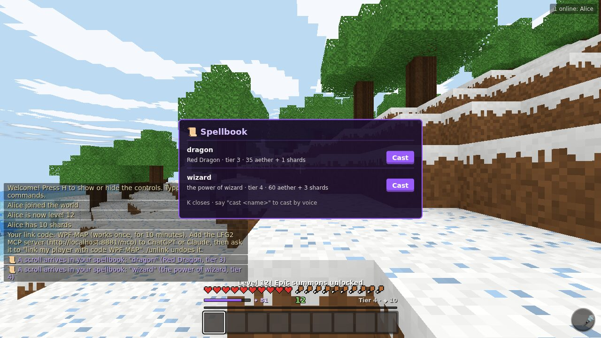

**Themes**: `create_world` (and `preview_theme`, which changes nothing) take a `theme` in words and
`reference_images` (or `reference_colors`). *"A cyberpunk sci-fi samurai inspired world"* gets
sakura-pink trees, dark-teal ground, vermilion wood, a violet night sky, pagoda villages with neon
strips, ninja raids and music in A minor. Everything else stays shared. See
[docs/standards/world-themes.md](docs/standards/world-themes.md) for what a theme sets, its
safeguards, and what it means for the base world.

| Base world | The same spot in a cyberpunk samurai world |
|---|---|
| 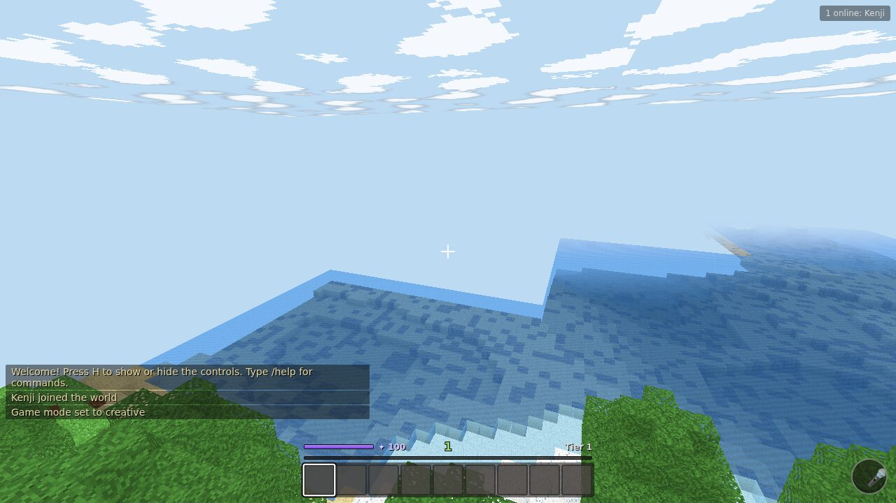 | 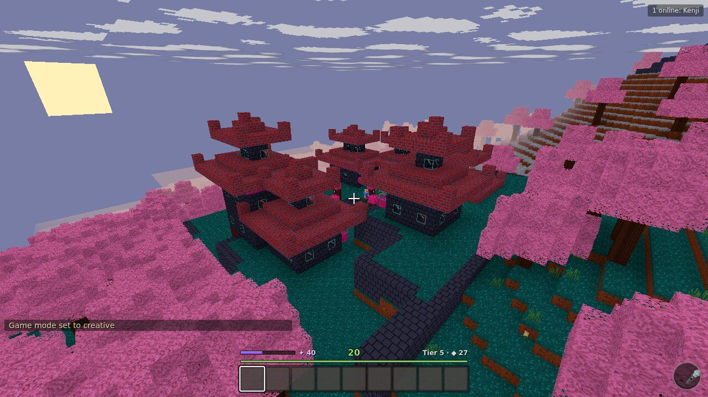 |

**Worlds**: a server can run several worlds. Join one with `?world=<name>` in the address or pick
it on the title screen. `/worlds` lists them, and `/world open` opens yours. Levels and spellbooks
are per world. Worlds nobody is in are unloaded after 10 minutes. Created worlds belong to their
creator, who is their admin. A player can create 2, and a server holds up to `MAX_WORLDS` (10).

### Designing new things, and styles beyond voxels

Describing a summon uses the game's own planner. A chat can also **design** one: the model, as
parts built from primitives (capsules, cones, wedges…) with animation roles. It checks the design
and looks at renders, as many times as it likes for free, then saves it to the world. See
[docs/AI-INTEGRATION.md](docs/AI-INTEGRATION.md) for the loop, and a review of every component for
when a real model writes specs.

Creatures don't have to be blocky either. The world rule `art.modelStyle` draws them `smooth`,
`lowpoly` or **`sculpted`**: designs drawn from their primitives with smooth joins, gloss, metal
and glowing finishes, and up to 4× the triangle budget up close (a simpler version takes over
further away). A theme with words like *claymation*, *low-poly* or *figurine* sets the world's
style, `/rule set art.modelStyle sculpted` changes it live, and **each player can pick their own
in Settings → Creatures**.

**Design skills** make results consistent: `interpret_prompt` reads "a cute pink dragon" as the
winged-creature skill in a cute mood. It returns a brief and a starting design (big head, round
forms, horns and a tail), and the checks then critique the design against that brief.

| Lantern moth, sculpted | The same moth at night (glowing belly) | "A cute pink dragon", from its brief |
|---|---|---|
| 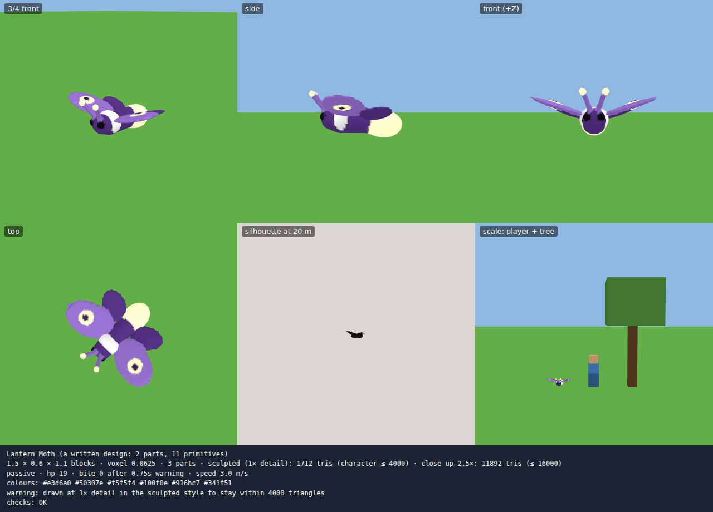 | 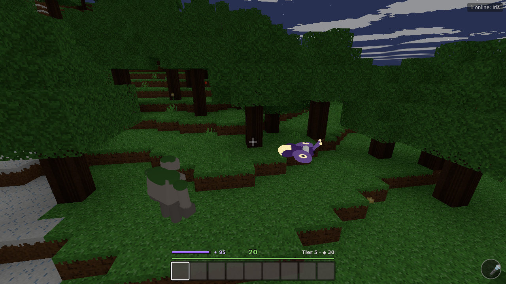 | 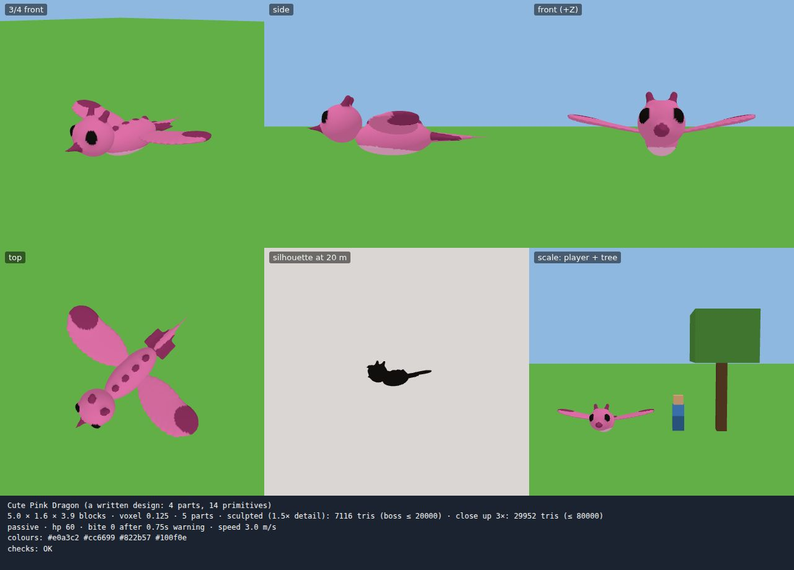 |

| A design summoned in game | The same world after `/rule set art.modelStyle smooth` | A design rendered low-poly |
|---|---|---|
| 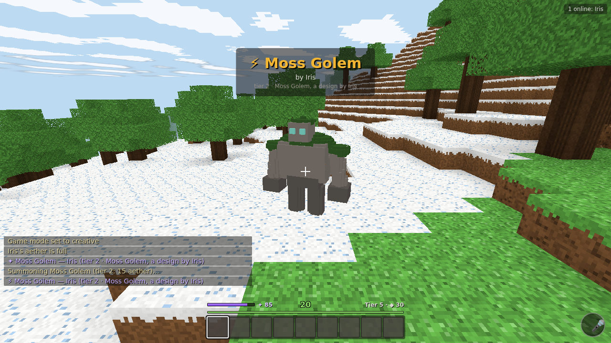 | 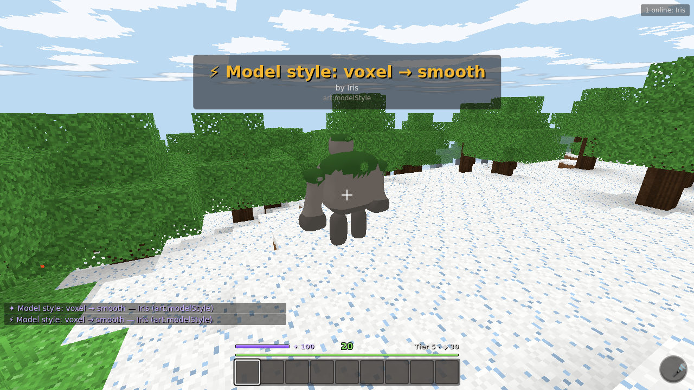 | 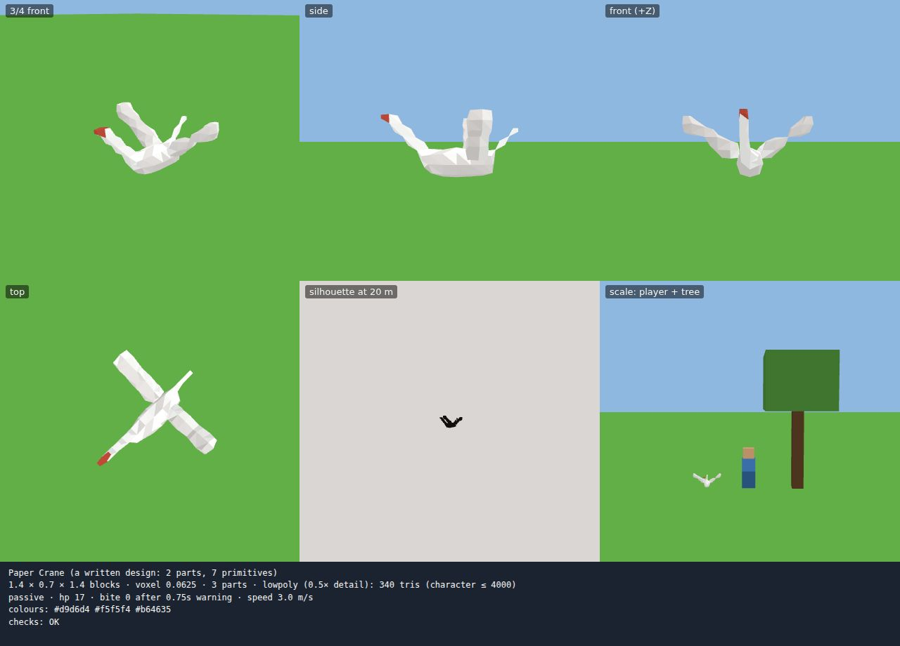 |

## Voice commands

Hold **B** (or the 🎤 button in the corner) and say what you want: *"summon a flying shark"*,
*"start a ritual to summon a red dragon"*, *"join the ritual"*, *"start an event where pirates
raid the coast in three waves"*, *"make me a wizard"*, *"how much would a village cost"*, *"cast kraken storm"*, *"stop the raid"*,
*"what's my level"*. Release, and the panel
shows what was heard and the command it becomes; commands go after 2 seconds (Enter: now, Esc:
cancel). Anything that isn't a command becomes a chat line, and waits for Enter.

| What was heard | A ritual circle to join |
|---|---|
| 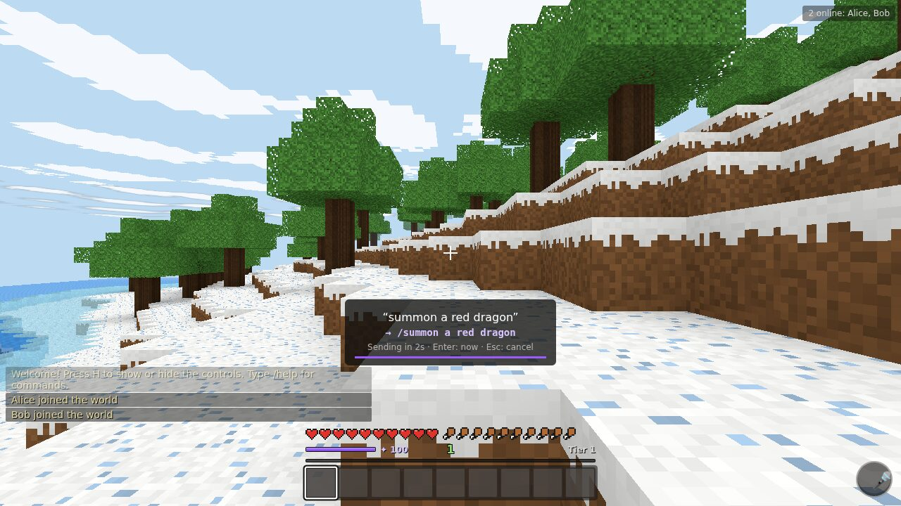 | 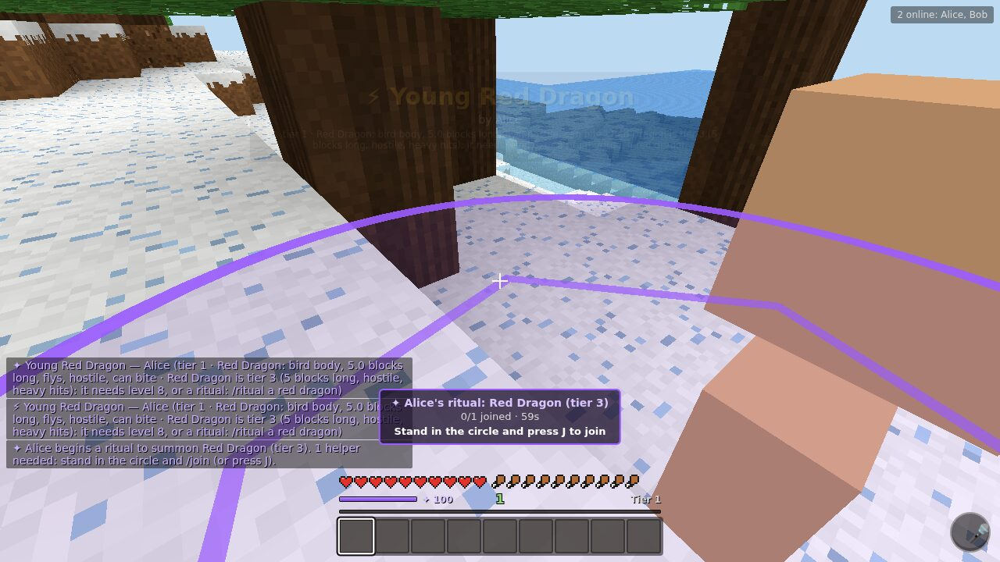 |

Speech becomes text in one of two ways (Settings → Voice: Automatic / Game server / This browser / Off):

- **Game server** (used automatically when set up): the clip is recorded in the browser and sent
  to the game server, which forwards it to an OpenAI-compatible transcription endpoint and returns
  the text. Works in every browser with a microphone. Set it up with environment variables:

  | Variable | Meaning |
  |---|---|
  | `TRANSCRIBE_URL` | e.g. `https://api.openai.com/v1/audio/transcriptions`, Groq's, or a self-hosted Whisper server (whisper.cpp / faster-whisper-server) at `http://localhost:8000/v1/audio/transcriptions` |
  | `TRANSCRIBE_API_KEY` | the key for it (or set `OPENAI_API_KEY` alone to use OpenAI) |
  | `TRANSCRIBE_MODEL` | model name (default `whisper-1`) |

  Only players connected to the game can use it (a token per session), clips are at most 2 MB,
  12 a minute per player, and audio is never stored. The game's vocabulary is sent as a hint.
- **This browser**: the Web Speech API (Chrome, Edge, Safari), with live text while you speak.
  Nothing goes to the game server, but the browser maker does the recognition.

The microphone is only open while you hold the key or button.

## How the code is organised

```
packages/
  shared/   game rules used by both sides: content registry, chunks, terrain generation,
            physics, raycasting, crafting and windows, dig/drop rules, network protocol,
            and the vanilla content pack (blocks, items, recipes, textures-as-code, mob models)
  server/   authoritative server: the kernel (module host), world store and persistence,
            terrain worker threads, networking, and the vanilla gameplay modules
  client/   browser client: Three.js renderer, mesher workers, player controller, HUD and UI
docs/       architecture and the world standards
scripts/    end-to-end browser test
```

The base game is itself a set of modules (`packages/server/src/modules/vanilla/`):
`nature`, `building`, `explosives`, `items`, `survival`, `combat`, `mobs`, `containers`, `progression`, `powers`, `summons`, `scenarios`, `builds`, `spellbook`, `commands`.
Each one only uses the `ModuleApi` (`packages/server/src/api.ts`), the same surface agent-written
modules will get. The kernel tags every handler with its module, so a module can be switched off
(`/module off vanilla:mobs`) and its errors are contained: a module that keeps throwing is switched
off automatically and announced as a world event, instead of crashing the server.

## What's not built yet

Compared with Minecraft: flowing water and lava, farming, beds, doors, ladders, armour, bows,
sheep/wool from animals, the Nether/End, redstone, villages. Blocks with a front face (furnace,
chest) always face south for now.

Scenarios: only invasions from the sea so far (the planner is a keyword stand-in for an agent
writing specs); raiders walk straight at you (no pathfinding, though stuck ones come ashore
again); losers simply vanish rather than rowing back; there's no sound for the boss slam yet.

Compared with the architecture: per-player agent sessions (the world-event pipeline they will
use is built), process-level sandboxing of module code (today module code runs in the server
process; the shadow run, import ban, error containment and CPU budget limit the damage, but a
determined module could still misbehave; V8 isolates are the next step), client-side (visual)
modules, and server-side entity lighting.
