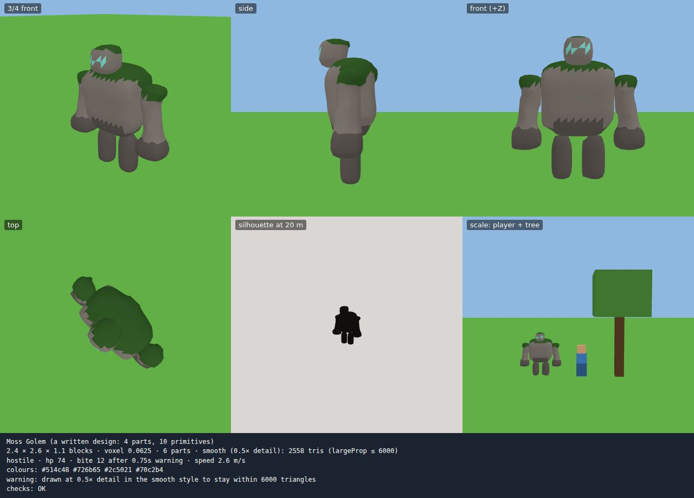
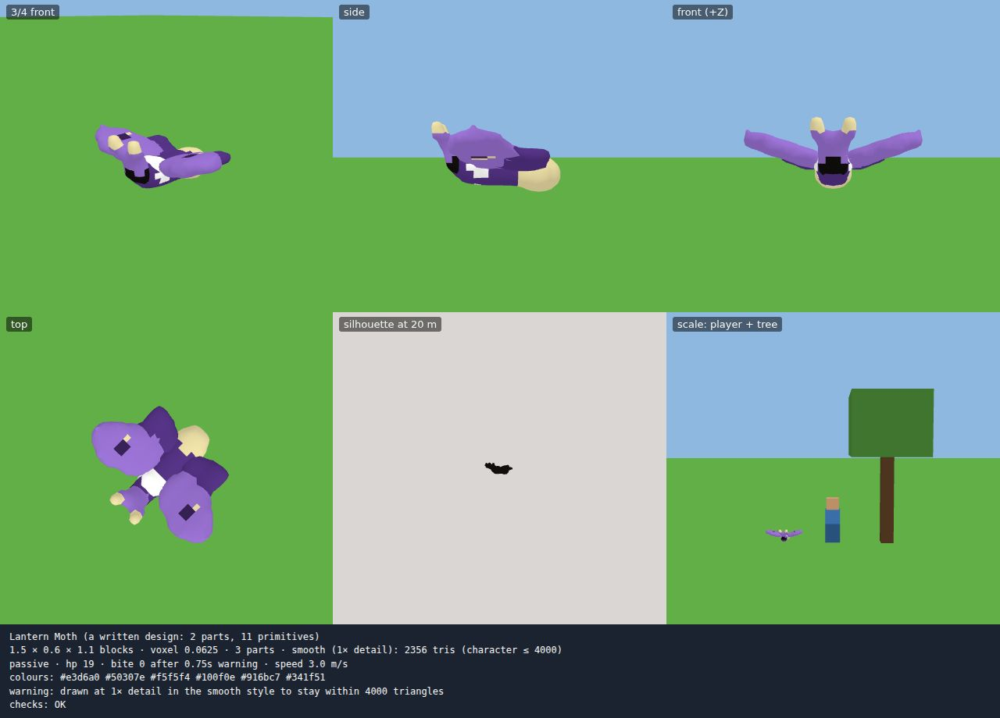
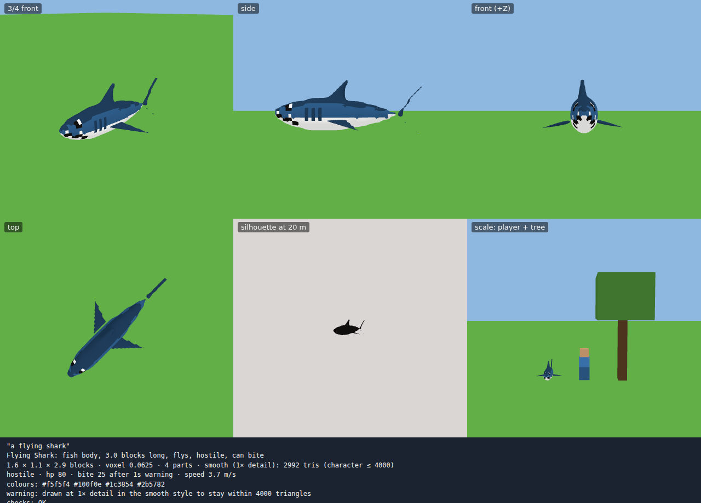

# Linking real AI: a component-by-component review

Today every "AI" step in the game is a stand-in: keyword planners turn a sentence into a
structured spec, and everything after that (checks, playtests, world events, undo) is real. This
review covers each component and what changes when a language model (or a player's own chat,
through MCP) writes the specs. It says what this round built and what's still to do.

The principle throughout: **agents write data, never trusted code paths.** Every agent output is a
spec with a schema. Before the spec touches the world it is validated, built, checked against the
standards and playtested. Mistakes come back as issues with JSON paths and hints, so the agent can
repair them in a few turns. The world only changes through world events, which can fizzle and be
undone.

## The design loop (built)

```
get_design_guide ──▶ write a design (JSON) ──▶ check_design ──issues + hints──┐
        ▲                                         │ ok                           │
        │                                         ▼                              │
        └──────────── fix ◀── look ◀── render_design (6 views, report) ◀────────┘
                                                  │ looks right
                                                  ▼
                       save_design ──▶ /summon design:<id>, or a scroll ──▶ world event
```

| Step | What it does |
|---|---|
| `get_design_guide` | The JSON format, the 7 primitives, animation roles, limits, **this world's** palette and model style, triangle budgets, and a working example to copy |
| `check_design` | Every check a cast makes: field types and enums, shape validation, size and hostile-length rules, colours in the palette, triangle budget in the world's style, readability (contrast, camouflage on grass/sand/stone, parts that float), tier, and a **playtest on the world's land** with virtual players. Free |
| `render_design` | Headless Chromium renders the model viewer: 3/4, side, front, top, a silhouette at 20 m, and next to a player and a tree, in the world's colours and style (or another style to compare). It returns the image plus the report, so a vision model can judge it |
| `save_design` | Saved per world, owned by its author. A revision gets a new content-hashed entity id, so clients rebuild it |
| In game | `/summon design:<id>` at its tier's normal cost, `/designs` to list them, scrolls can hold `design:<id>`, and rituals and tier scaling work as usual |

Iterating on a few designs this way (see `scripts/designs/` and `scripts/design-loop.mjs`) showed
what an agent needs from the tools:

- **Checks catch what renders don't, and the reverse.** The paper crane's wings floated 0.18
  units above its body. The render looked fine, but the "doesn't touch" check caught it. The moss
  golem's moss was exactly the grass colour, so it vanished from above. That became a camouflage
  check: "seen from above, 79% of it is the grass colour".
- **Hints should name the fix, not only the rule.** "cube" → use box; "purple3" → try violet1–5;
  "moss" → green; "arm" → use armL on the +x side with `mirror: true`.
- **Thin parts must survive.** A fin thinner than a voxel used to vanish when it sat between voxel
  centres. Thin sides now always keep one layer, and smooth styles keep every solid voxel inside
  the surface.
- **Mirroring halves the work and the mistakes**, for parts (wings, legs) and for primitives
  (eyes, horns).

| Moss golem, smooth | Paper crane, low-poly | Lantern moth, smooth |
|---|---|---|
|  |  |  |

| Summoned with `/summon design:moss_golem` | After `/rule set art.modelStyle smooth` |
|---|---|
|  |  |

## Beyond voxels: model styles (built)

`art.modelStyle` is a world rule. It can be set by a theme ("low-poly", "faceted", "origami",
"claymation", "smooth") or changed live as a world event, which redraws creatures that are
already there.

| Style | How it's drawn | Detail |
|---|---|---|
| `voxel` | greedy-meshed cubes (the default; the terrain is always blocks) | 1 voxel = 1 cube |
| `smooth` | surface nets over a blurred density field, Laplacian-smoothed, smooth normals; each triangle takes one colour so eyes and stripes stay crisp | 2×, 1× or ½× the voxel grid: the finest that fits the asset budget |
| `lowpoly` | the same surface, coarser, with flat facets | ½× or ⅓× |

| Flying shark, smooth (2992 triangles) | Flying shark, low-poly (588) |
|---|---|
|  |  |

Every style starts from the same voxel model, so all checks, budgets, hitboxes and animation
roles stay the same, and clients build exactly what the server checked. Triangle budgets are
checked in the world's style: a smooth world gets fewer, rounder details within the same budget.

**Higher fidelity than this (not built):** text-to-3D services such as Meshy, Tripo, Rodin,
Hunyuan3D and TRELLIS (self-hostable, image-to-3D) return textured meshes (glTF) in about
half a minute to two minutes, for roughly ten to thirty cents per model at the time of
writing. The safest way to use them is to **voxelize their output into a VoxelModel**
(about 2× the summon grid, snapping colours to the world palette), then run the normal
pipeline. That keeps the style consistent and the budgets, palette and moderation checks
working, with no new client code. Animation is the hard part: a mesh needs splitting into parts
with roles (wings, legs, tail). Either the agent writes the parts as a shape and only uses the
service for detail, or segmentation picks them. Use these services as an optional higher tier,
because they cost money and time per summon. Cache them by content hash and moderate the renders.

Research on LLMs writing 3D as code (benchmarks like 3DCodeBench, P3D-Bench and VoxelCodeBench, and
work on primitives as a spatial language for vision-language models) points the same way as this
loop:

- A small primitive language is easier for a model than raw meshes.
- Multi-turn error feedback fixes most failures in two or three rounds.
- Showing the model renders of its own output helps further.

## Component by component

| Component | Today | When an agent writes it | Status |
|---|---|---|---|
| **Summons** (`planSummon`) | keywords → SummonSpec from a table of nouns | the agent writes a design (spec + shape) and runs check/render | **built**: designs, shapes, checks with paths and hints, renders, playtest, library |
| **Model generation** | 7 body-plan generators | shapes (primitives → voxels) for anything the generators can't make; generators remain the fallback | **built** |
| **Model styles** | voxel only | smooth / low-poly from the same model; text-to-3D import as an optional tier | styles **built**; import: plan above |
| **Scenarios** (`planScenario`) | keywords → ScenarioSpec (ships, waves, bosses) | the agent writes the ScenarioSpec; members can be designs. It needs a `check_scenario` that runs the existing scenario playtest (difficulty curve, time to clear) and returns paths and hints | next |
| **Builds** (`planBuild`) | traits → procedural village, castle or city | the same shape language in **block** units, so an agent writes buildings as primitives with block materials. The existing checks (never over player work, temporary unless adopted) stay | next |
| **Powers** | a fixed catalog of timed buffs by tier | compose from effect primitives (speed, jump, flight, spell) with a tier budget, checked like summons | later |
| **Behaviour** | brain presets per movement and temperament, plus abilities | a declarative behaviour spec (states, triggers, cooldowns, warnings), checked by the playtest, **not code**. Code modules stay for trusted authors | later |
| **Rules** | `/rule set path value`, range-checked, locked rules, world events | already agent-ready (typed paths, limits, undo). An agent should also give a reason, shown to players | small |
| **Code modules** | hot-loaded, shadow-run, import ban, CPU budget, auto-undo | agents should rarely write code. When they do, run it in V8 isolates (the next step in ARCHITECTURE.md) with an explicit capability list | open |
| **Themes** (`planTheme`) | motif keywords + colours from reference images | the agent writes the ThemeSpec directly (the type exists). The same safeguards apply: reserved colours, ground glare, locked rules | small: accept a `theme_spec` in `create_world` |
| **Voice** | transcription → a deterministic intent parser | keep the parser as the fast path; send what it can't parse to an LLM with the same intents as a tool schema, so the result is still a command, never free text | later |
| **MCP** | link codes, scrolls, worlds, designs | per-session rate limits, and metering against each tier's AI token budget (`progression.tokenBudgetByTier`) once the server itself calls models | partly |

## What has to be true before a model is in the loop

1. **Schemas everywhere, validated on the server.** Already true for rules, themes, scrolls and
   now designs. Never pass model output straight to a generator: `generateModel` only builds a
   shape that validates, and otherwise falls back to the body plan.
2. **Repair, not rejection.** Every issue has a JSON path, a message and a hint. An agent should
   get at least three rounds. Render feedback is a separate, optional round, because it costs a
   headless browser render, about 1–2 s on a CPU.
3. **Budgets the world can afford.** Each tier has an aether cost, a triangle budget and an AI
   token budget. Server-side model calls should be metered against the token budget and refunded
   when a cast fizzles, like aether.
4. **Prompt injection.** Player names, chat, scroll prompts, design names and descriptions all
   reach agents. Treat them as data: quote them, never put them in instructions, and keep tools
   that act on the world behind the player's own link and costs. A design can only change itself,
   and casting it still goes through the world-event checks.
5. **Moderation.** Text fields go through a text filter. Shapes can draw symbols, so a vision
   check on `render_design`'s silhouette and front view is the natural gate before
   `save_design` on public servers. Reference images are only reduced to colours, and are never
   stored.
6. **Determinism and caching.** The same spec and palette always give the same model, on the
   server and on every client, and design ids carry a content hash. Cache model outputs by
   prompt + world-standards hash, so the same request costs nothing twice.
7. **Evals.** `scripts/design-loop.mjs` and the `scripts/designs/` folder are the start of an eval
   set. Next: golden prompts with expected tiers and kinds, checks that must pass, and rendered
   views scored by a vision model ("does this read as a moth from 20 m?"). Run them whenever
   the standards change.

## Try it

```sh
npm run build
node scripts/design-loop.mjs scripts/designs/*.json          # check + render each design through MCP
STYLE=smooth node scripts/design-loop.mjs scripts/designs/moss-golem.json
npm run e2e:designs                                           # the whole loop, with a player in the browser
```
