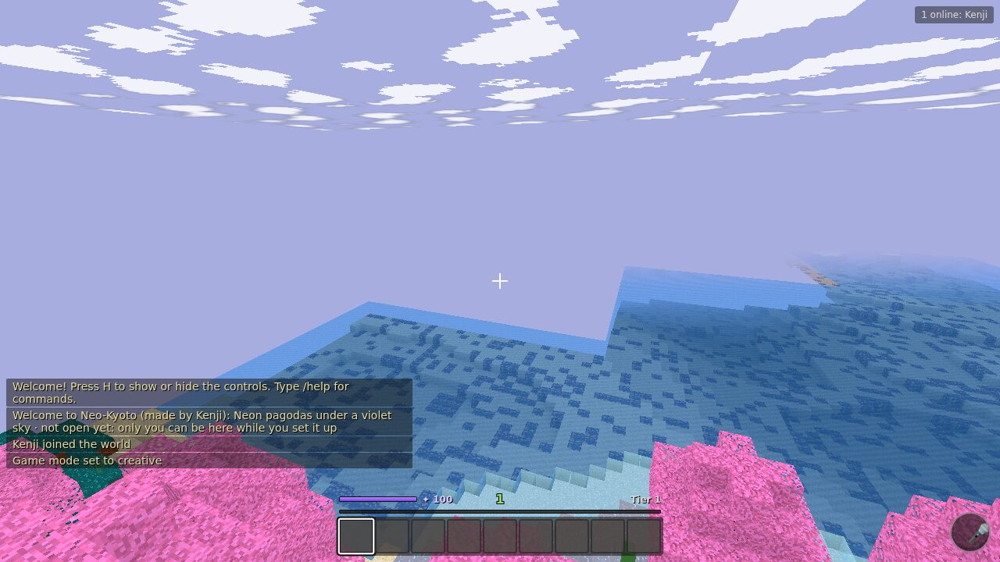
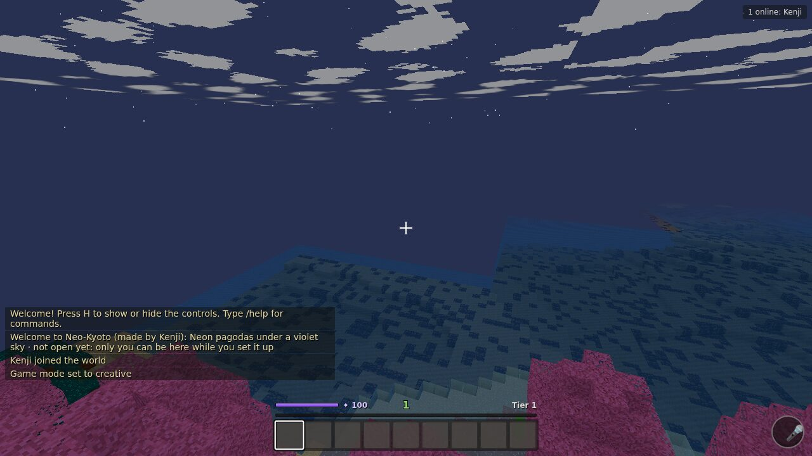

# World themes

A world can have its own look and feel, asked for in words and pictures: *"a cyberpunk sci-fi
samurai inspired world, neon-lit pagodas, cherry blossoms"*, plus a few reference images. The
creator's chat sends this to `create_world` (or tries it first with `preview_theme`) through the
MCP server, and the world arrives that way before anyone else joins.

| Base world (same seed, same spot) | Neo-Kyoto, at noon |
|---|---|
|  |  |
| **Neo-Kyoto as it starts (night)** | **A village raised there** |
|  |  |

## What a theme sets

All of it as ordinary world rules (59 changes for Neo-Kyoto), through the same checks as any rule
change:

| | From the words | From the reference images |
|---|---|---|
| **Palette** | each style word anchors some hue ramps (cyberpunk: magenta, violet, cyan; samurai: vermilion, sakura pink, pine green, gold), blended where they overlap, the first word leading | saturated colours replace their hue's ramp; a dark one tints the greys |
| **Materials** | which colour grass, leaves, wood, bark, stone, sand, snow, glass, wool and the sky use (sakura-pink leaves, dark-teal ground, vermilion wood, a violet sky) | |
| **Light** | when the world starts (cyberpunk: night) and the day length | |
| **Creature style** | *low-poly, faceted, origami* draw creatures faceted; *smooth, claymation, soft* draw them rounded (`art.modelStyle`; the terrain stays blocks) | |
| **Music** | key, mode and tempo (cyberpunk: A minor, 112 bpm); the event stingers play in that key | |
| **Defaults** | the build style (eaves roofs, neon strips, stone walls), the raid theme (ninjas: a ninja raid with a samurai warlord and an oni king), and creature ideas (samurai, ninja, oni, cyborg) | |

Reference images are only read for their dominant colours (a small k-means). They're never stored
or shown to anyone, so a picture can set a mood without the world copying it.

## Safeguards

- **Reserved colours never change**: danger, water, ice, heal, interact, magic and the team
  colours mean the same thing in every world. A palette colour that comes too close to the danger
  colour is nudged away.
- **The ground can't glare**: a very bright, saturated colour for grass, dirt, stone or sand steps
  down to a darker shade.
- **Locked rules stay locked**, and every value goes through the normal type and range checks.
- **Other worlds are untouched**: each world has its own copy of the standards.

## What this means for the base world

1. **No visible change.** Building this needed one refactor of the base content: textures used to
   name palette colours directly (leaves were `green2`, grass `green3`), so a theme couldn't make
   cherry-blossom trees without pink grass. Textures now use **material slots**
   (`art.materials`), which point at palette colours. The defaults point exactly where the old
   code did, and a test checks the base world's textures are pixel-identical. The base world can
   now be themed too, as a world event like any rule change.
2. **Shared content grows for everyone.** The new creatures (samurai, ninja, oni, cyborg/robot),
   the ninja raid theme, and the eaves and neon build styles are part of the shared planners, so
   they can be summoned in every world. A theme only changes what's *default* in its world.
3. **Same blocks and items everywhere.** Themes recolour and restyle; they can't add block types
   per world (clients and server must agree on the content). So:
   - "Neon" strips are wool in the theme's neon colour. They don't **glow**: making them light
     sources needs a new block that emits light, added for every world.
   - Water stays the reserved water colour (no acid-green canals).
   - There are no bamboo, lantern or rain-on-neon blocks yet.
   Each of these would be new shared content, not a theme.
4. **Terrain is the same generator.** A theme recolours the land but doesn't reshape it (no city
   grid, no floating islands). Different terrain would be a world-generator option, chosen when
   the world is created: the natural next step.
5. **Lighting is per world but not per material.** Night is darker everywhere; there's no
   emissive palette (neon at night only shows where torches are).
6. **Agents get the theme as context.** `get_world_guide` returns the theme (keywords, build
   style, raid theme, creature ideas, reference colours), so prompts refined in a chat fit the
   world.
7. **Copyright and safety.** Only colours are taken from images, and words set a style, not a
   copy of a franchise. Reference images would still need the same moderation as uploads if they
   were ever kept or shown.
